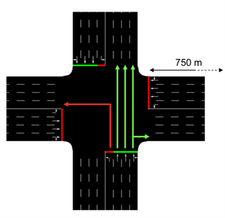

# One-Intersection simulation

## Environment

The SUMO [environment file](https://github.com/GameDisplayer/Deep-QLearning-Multi-Agent-Perspective-for-Traffic-Signal-Control/tree/master/TLCS/intersection/environment.net.xml) is composed of a four-lane intersections. It has been realised thanks to [Netedit](https://sumo.dlr.de/docs/Netedit/index.html).

<p align="center">

</p>

*Description:*
- The net is composed of 4 junctions `{W, N, S, E}` and 1 traffic light system `{TL}`. 
- Each branch of the intersection is composed of 2 edges : one for the 4 incoming lanes and the other for the 4 outcoming lanes.
- The lanes are 750 meters long. 
- Each edge is defined **FROM** one of the elements of the two sets **TO** another one. For instance, the edge `TL2N` is starting from `TL` and arriving at `N`. 
- Every edge is composed of 4 different lanes that are named by adding **'_n'** to the suffix of the edge id. For example, the 4 lanes of `TL2N` are `{TL2N_0, TL2N_1, TL2N_2, TL2N_3}`.
- The arrows are showing the directions that the vehicles can take.


## Run the algorithm 

### Training

1. Clone or download the repo.
2. Launch the script train.sh
     ```shell
    ./train.sh
    ```
3. (2bis) You could also run the following files by executing
    ```python
    python3 web_agent_training.py
    ```
    and 
    ```python
    python3 training_main.py
    ```
Now the agent should start the training.

You don't need to open any SUMO software since everything is loaded and done in the background. If you want to see the training process as it goes, you need to set to True the parameter gui contained in the file training_settings.ini. Keep in mind that viewing the simulation is very slow compared to the background training, and you also need to close SUMO-GUI every time an episode ends, which is not practical.

The file training_settings.ini contains all the different parameters used by the agent in the simulation.

When the training ends, the results will be stored in "./model/model_x/" where x is an increasing integer starting from 1, generated automatically. Results will include some graphs, the data used to create the graphs, the trained neural network, and a copy of the ini file where the agent settings are.

### Evaluating
1. Launch the script test.sh
     ```shell
    ./test.sh
    ```
2. (2bis) You could also run the following files by executing
    ```python
    python3 web_agent_training.py
    ```
    and 
    ```python
    python3 testing_main.py
    ```
Now you can finally test the trained agent. To do so, you have to run the file testing_main.py. The test involves 5 episodes of simulation (with different seeds), and the results of the test will be stored in "./model/model_x/test/" where x is the number of the model that you specified to test. The number of the model to test and other useful parameters are contained in the file testing_settings.ini.
